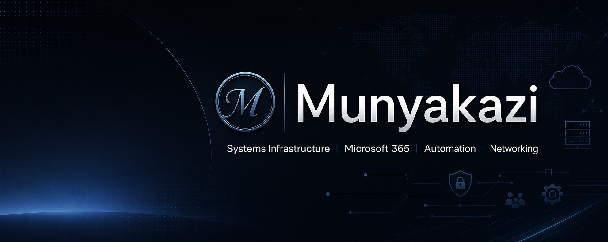

  

# Jean Claude Munyakazi

IT System Administrator | Network Administrator | IT Technician  
Focused on systems infrastructure, Microsoft 365, networking, cybersecurity, Linux, cloud, and automation.

<table>
  <tr>
    <td width="50%" valign="top">

## Focus

- Systems infrastructure
- Microsoft 365 administration
- Networking and secure access
- Linux server administration
- Automation and documentation

    </td>
    <td width="50%" valign="top">

## Featured Work

- Linux-based WordPress hosting setup
- Self-hosted Docker infrastructure
- WireGuard and Proxmox documentation
- Network and security visual references

    </td>
  </tr>
</table>

<table>
  <tr>
    <td width="50%" valign="top">

### Focus

- Systems infrastructure
- Microsoft 365 administration
- Networking and secure access
- Linux server administration
- Automation and documentation

    </td>
    <td width="50%" valign="top">

### Featured Work

- Linux-based WordPress hosting setup
- Self-hosted Docker infrastructure
- WireGuard and Proxmox documentation
- Network and security visual references

    </td>
  </tr>
</table>

<table>
  <tr>
    <td width="50%" valign="top">
      <h3>Focus</h3>
      <ul>
        <li>Systems infrastructure</li>
        <li>Microsoft 365 administration</li>
        <li>Networking and secure access</li>
        <li>Linux server administration</li>
        <li>Automation and documentation</li>
      </ul>
    </td>
    <td width="50%" valign="top">
      <h3>Featured Work</h3>
      <ul>
        <li>Linux-based WordPress hosting setup</li>
        <li>Self-hosted Docker infrastructure</li>
        <li>WireGuard and Proxmox documentation</li>
        <li>Network and security visual references</li>
      </ul>
    </td>
  </tr>
</table>

